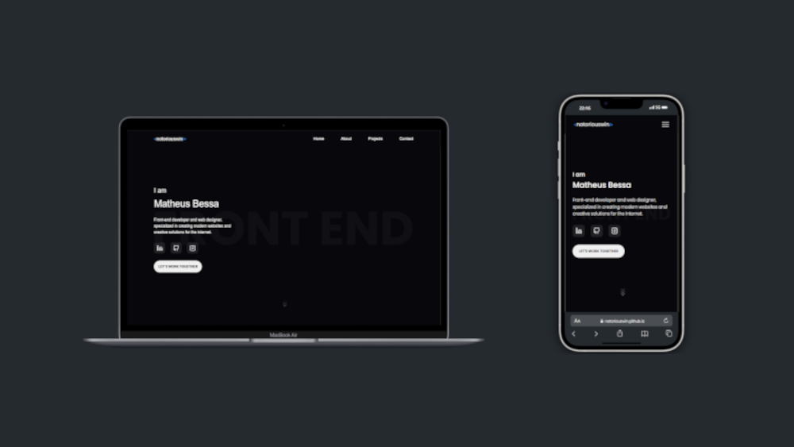

<h1 align=center>👽 Portfólio </h1>   

Bem-vindo(a) ao repositório do meu portfólio pessoal! 🚀   
Este projeto foi desenvolvido com o objetivo de apresentar meus projetos, habilidades e contar um pouco sobre mim enquanto evoluo como desenvolvedor front-end.
 

 
  
  
  

    
 
  
   
  
 

## 📫 Contribuindo para o Portfólio

Para contribuir com o Portfólio, siga estas etapas:

1. Bifurque este repositório.
2. Crie um branch: `git checkout -b <nome_branch>`.
3. Faça suas alterações e confirme-as: `git commit -m '<mensagem_commit>'`
4. Envie para o branch original: `git push origin <nome_do_projeto> / <local>`
5. Crie a solicitação de pull.

Como alternativa, consulte a documentação do GitHub em [como criar uma solicitação pull](https://help.github.com/en/github/collaborating-with-issues-and-pull-requests/creating-a-pull-request). 

## 📈 Colaboradores

Agradecemos às seguintes pessoas que contribuíram para este projeto:

<table>
  <tr>
    <td align="center">
      <a href="#">
         
        
          <b>Matheus Bessa</b>
        
      </a>
    </td>
  </tr>
</table>
